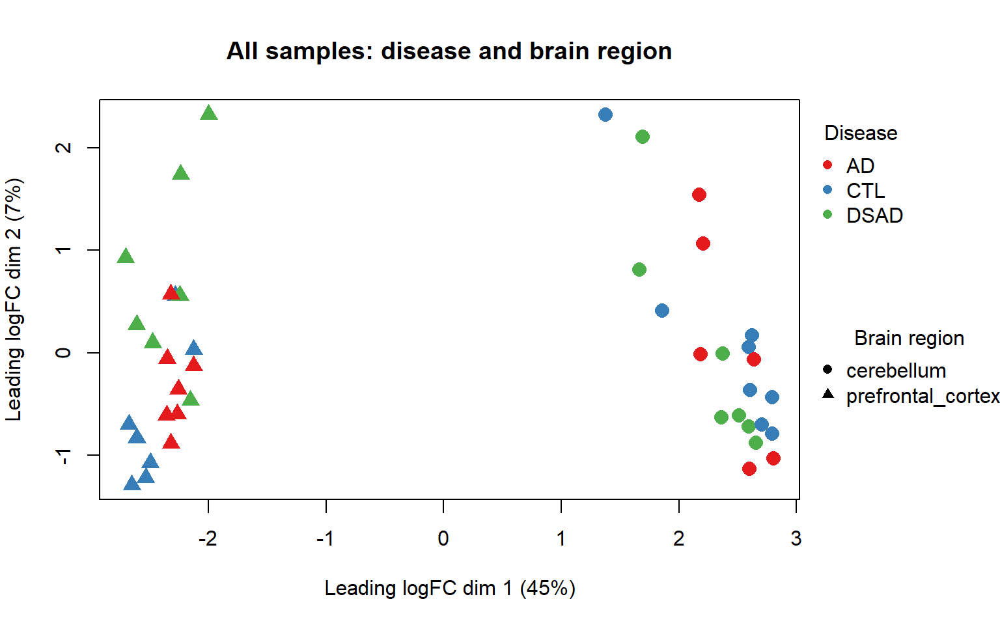
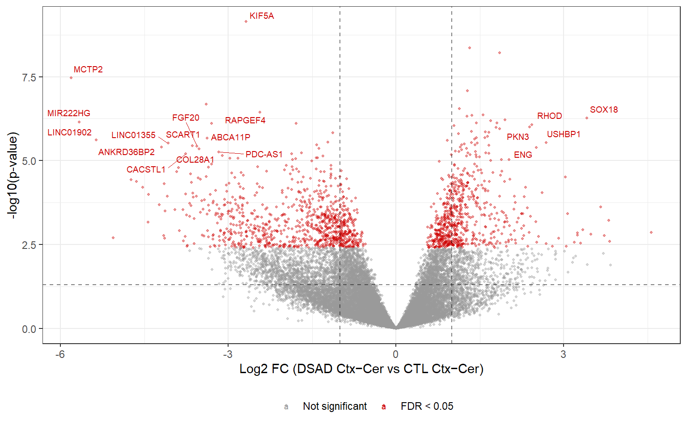
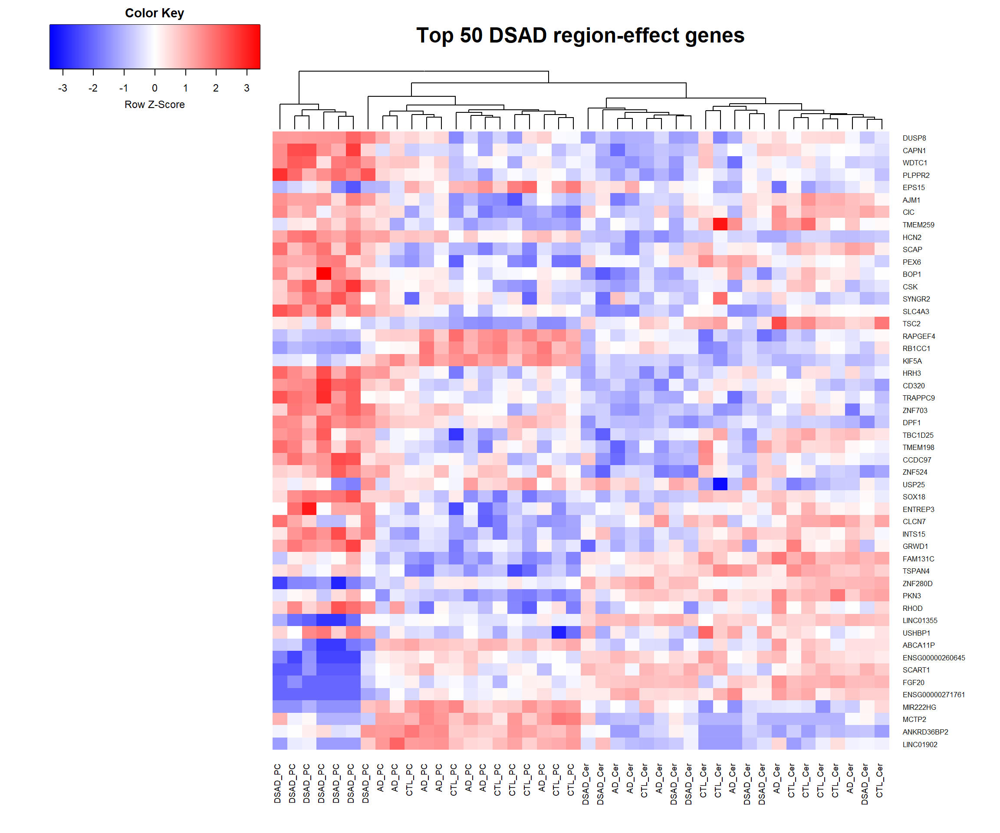
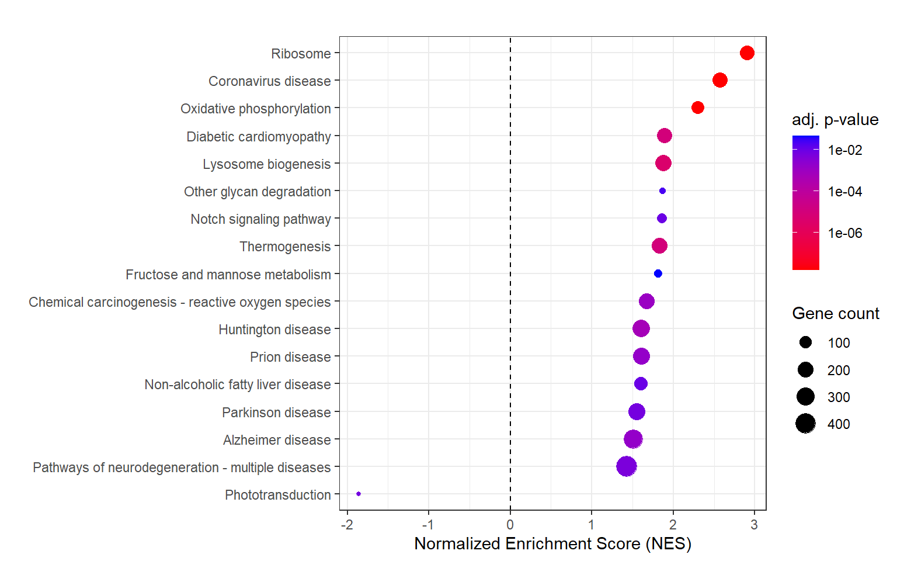

# Brain transcriptomics in Alzheimer's disease

A reanalysis of the RNA-seq data from Thorwald et al. (2025), covering
prefrontal cortex and cerebellum in cognitively normal controls (CTL),
sporadic Alzheimer's disease (AD), and Down syndrome with Alzheimer's
disease (DSAD).

The question I set out to answer:

> Does DSAD resemble sporadic AD at the transcriptome level, or does it show
> a different regional expression pattern?

The useful feature of this dataset is that cortex and cerebellum were sampled
from the same donors. I therefore looked at the cortex-cerebellum difference
within each person, rather than treating the two regions as independent
samples.

The full literate source, including all code, is in
[`Transcriptomics_AD.qmd`](Transcriptomics_AD.qmd). The rendered version is
[`Transcriptomics_AD.html`](Transcriptomics_AD.html) — self-contained, so
downloading and opening it in a browser is enough.

## Data

The data are publicly available through ArrayExpress as
[**E-MTAB-14179**](https://www.ebi.ac.uk/biostudies/arrayexpress/studies/E-MTAB-14179).

Thorwald et al. published the cohort and included an RNA-seq analysis in the
original paper. Their analysis and this one are not the same: this repository
focuses on the paired brain-region structure and, in particular, the
disease × brain-region interaction.

The dataset contains:

- 42 RNA-seq samples from 23 donors
- CTL: 8 donors, AD: 7 donors, DSAD: 8 donors
- 19 donors contributed both prefrontal cortex and cerebellum; the remaining
  4 contributed one region only
- all donors APOE3/3
- age, sex, Braak stage and PMI available in the metadata

The DSAD samples were collected at UCI, while the AD and control samples were
collected at USC. This matters throughout the analysis, because site and DSAD
status are completely confounded.

## What I did

The deposited gene-level count matrix was filtered and TMM-normalized with
edgeR, then analyzed with limma-voom. Gene annotation came from Ensembl via
biomaRt.

The analysis has three main parts.

### 1. AD vs CTL within each brain region

Prefrontal cortex and cerebellum were analysed separately, comparing AD with CTL:

    expression ~ group + age + sex

DSAD was excluded from these comparisons — DSAD status is completely confounded 
with collection site (all DSAD from UCI, all CTL/AD from USC).

**No FDR-significant genes in either region.**

Sample sizes: prefrontal cortex 7 AD vs 7 CTL, cerebellum 6 AD vs 8 CTL 
(not every donor contributed both regions).

This is not evidence that AD has no transcriptional effect. Power is limited 
at n=7/group in bulk tissue with substantial cellular heterogeneity. 
The strongest nominal prefrontal cortex associations — VGF↓, CRH↓, SCG3↓ 
— converge on neuroendocrine/synaptic decline consistent with the AD literature, 
but do not survive multiple-testing correction.

**Covariate decisions:**
- **Sex**: balanced (3-4/group) — included
- **Age**: included — varies within group and has direct effects on brain gene expression
- **Braak**: not included — collinear with diagnosis (CTL=0-1, AD=3-6)
- **PMI**: not included — no group difference (Kruskal-Wallis p=0.72 prefrontal cortex, 
  p=0.85 cerebellum), negligible correlation with expression (r=0.12), 
  and 3 samples have missing values
- **Site**: cannot be modelled — fully confounded with DSAD group membership

### 2. Braak-associated expression

I also treated Braak stage as a continuous variable in CTL + AD donors:

    expression ~ Braak + age + sex

This was exploratory, intended to check whether the binary AD/CTL comparison
was missing a severity-related signal. DSAD donors were excluded here, since
they are all Braak 6 and provide no gradient.

**No genes reached FDR < 0.05 in either region.**

In cortex, VGF, SCG2 and SCG3 were among the strongest nominal associations,
decreasing as Braak stage increased. In cerebellum the strongest nominal
associations were different — histone variants and CKS2 — with little overlap
between the two regions (3 shared genes in the top 50, 4 in the top 100).
Since nothing survived FDR correction, I treat this as hypothesis-generating
rather than a result.

### 3. Disease × brain-region interaction

This is the main analysis.

Rather than asking whether DSAD has higher or lower expression than controls
in one particular tissue, I asked whether the **cortex-cerebellum difference**
changes with disease status. For each donor with both tissues:

    cortex - cerebellum

The model then compares those within-person regional differences between
groups. The interaction contrasts were:

    AD:
    (AD cortex - AD cerebellum) - (CTL cortex - CTL cerebellum)

    DSAD:
    (DSAD cortex - DSAD cerebellum) - (CTL cortex - CTL cerebellum)

Paired samples were handled in limma using `duplicateCorrelation`, with donor
as the blocking variable. There were 19 complete pairs:

| Group | Complete pairs |
|-------|---------------:|
| CTL   | 7 |
| AD    | 6 |
| DSAD  | 6 |

The result:

| Contrast | Down | Up | Total FDR-significant |
|----------|-----:|---:|----------------------:|
| AD × region | 0 | 2 | 2 |
| DSAD × region | 883 | 662 | **1545** |

In this cohort, the cortex-cerebellum expression relationship changes far more
in DSAD than in sporadic AD. That is the main observation from this
reanalysis.

These are not "DSAD DEGs" in the usual sense. Each of the 1,545 is a gene
whose cortex-cerebellum difference is itself different in DSAD than in
controls, which says nothing about which of the two regions moved, or in which
direction.

The paired design also does less than it might appear to. It removes
donor-level variation shared across a donor's two regions, but site is a
donor-level property too, and every DSAD donor came from UCI while every
AD/CTL donor came from USC. A site effect on the cortex-cerebellum
relationship would land in this interaction term looking exactly like a DSAD
effect.

## Figures

### Brain region is the main source of separation



The first MDS dimension (45% of variance) separates prefrontal cortex from
cerebellum very strongly. Disease groups show no comparable separation.

This is why I did not pool cortex and cerebellum for the AD/CTL comparisons.

### DSAD cortex-cerebellum interaction



The interaction produces 1,545 FDR-significant genes. Among the top hits 
by statistical significance and effect size: KIF5A (axonal transport), 
TSC2 (mTOR/autophagy), PEX6 (peroxisomal biogenesis) and RAPGEF4 
(intracellular trafficking).


### Top DSAD region-effect genes



Expression of the top 50 genes by adjusted p-value from the DSAD 
cortex−cerebellum interaction contrast, scaled by row.

### Pathway enrichment



Preranked GSEA against KEGG returned 17 significant pathways (16 with positive
enrichment, 1 negative). The strongest positive enrichments include ribosome,
oxidative phosphorylation, lysosome biogenesis and the KEGG Alzheimer disease
pathway; a reactive oxygen species pathway also appears among the significant
results. The single negative enrichment was phototransduction.

That combination points toward proteostasis, intracellular trafficking and
oxidative/mitochondrial metabolism, though enrichment of a pathway's
transcripts is a long way from showing the pathway is actually impaired.

The oxidative-stress signal is nevertheless interesting alongside the original
Thorwald study, which reported protein-level evidence of oxidative stress and
ferroptosis in this cohort.

## How this compares with the original analysis

The original study and this reanalysis answer somewhat different questions.

| | Thorwald et al. 2025 | This analysis |
|---|---|---|
| Data | E-MTAB-14179 | Same |
| RNA-seq approach | RUVSeq + DESeq2 | edgeR + limma-voom |
| AD vs CTL cortex | 10 DEGs (incl. VGF) | 0 FDR-significant (VGF top nominal) |
| AD vs CTL cerebellum | 1374 DEGs | 0 FDR-significant |
| Age adjustment | Not stated | Included in AD/CTL models |
| Braak analysis | Not a focus | Exploratory |
| Paired cortex/cerebellum interaction | Not tested | Main analysis |
| DSAD × region | Not tested | 1,545 FDR-significant genes |
| Pathway analysis | IPA | clusterProfiler / KEGG GSEA |

The DEG counts differ, but the pipelines differ enough that the comparison
doesn't mean much. The original used RUVSeq with unreported parameters,
followed by DESeq2, with no stated age adjustment or FDR threshold; this one
uses TMM normalization and limma-voom, adjusting explicitly for age and sex.
Without the full methodological detail from the original there's no way to run
a like-for-like comparison, and the counts on their own can't settle which
pipeline is closer to right.

What I was after was different anyway: what shows up once the paired regional
structure is modeled explicitly.

## What I think the data show

This cohort is too small to say much about sporadic AD on its own, so the
null results below are about detection, not about AD. What the data do show:

1. Cortex and cerebellum differ from each other far more than the disease
   groups differ from each other in global expression.

2. Conventional AD-vs-CTL comparisons produce little detectable signal at this
   sample size after FDR correction, though several biologically plausible
   genes appear among the strongest nominal associations.

3. The cortex-cerebellum relationship is altered much more in DSAD than in
   sporadic AD: 1,545 genes at FDR < 0.05 in the DSAD interaction, against two
   for AD.

That last result was the most informative finding to emerge from the paired 
design and the reason I think the paired angle was worth pursuing even in a small 
cohort.

The catch is that DSAD donors differ from the other two groups in several ways
at once: trisomy 21, roughly 30 years younger, samples processed at a different
site. Any of those could move the cortex-cerebellum relationship, and this
design cannot separate them. Pinning 1,545 genes on DSAD biology specifically
would need a site-matched cohort with overlapping ages.

So what the data support is narrower than it first looks:

> In this cohort, DSAD is associated with a substantially different
> cortex-cerebellum transcriptional response from sporadic AD.

## Limitations

- **Small sample size.** Seven to eight donors per group, and only six
  complete pairs in each disease group for the interaction model. Negative AD
  results mean no detectable signal, not evidence of equivalence.

- **Site is completely confounded with DSAD.** DSAD samples were collected at
  UCI, AD/CTL at USC. This cannot be fixed statistically in this design, and
  the paired model does not address it.

- **Age differs strongly between groups.** DSAD donors are substantially
  younger than AD and CTL. Age was included as a covariate in the AD vs CTL 
  models. For DSAD, the paired within-person design absorbs age differences 
  by construction — but this is not the same as having age-matched groups.

- **Braak is strongly correlated with diagnosis.** CTL donors are Braak 0-1, 
  AD donors Braak 3-6 — so the Braak gradient analysis largely recapitulates 
  the group comparison rather than adding a truly independent severity dimension. 
  Results are directionally consistent with AD vs CTL, which is reassuring, 
  but not independent confirmation.

- **Bulk tissue.** Expression changes cannot be assigned to cell types. A
  change in a microglial marker could reflect microglial abundance, cell
  state, or both.

- **Pathway enrichment uses the same data.** GSEA here is complementary to the
  differential-expression results, not independent replication of them.

## Reproducing the analysis

Requires R 4.5+ and [Quarto](https://quarto.org/). R packages:

```text
tidyverse   edgeR       limma        Glimma
biomaRt     ggrepel     gplots       knitr
RColorBrewer            clusterProfiler
enrichplot              org.Hs.eg.db
```

```
quarto render Transcriptomics_AD.qmd
```

Gene annotation is cached to `data/gene_annotation.rds` after the first
successful run, since Ensembl's public BioMart has intermittent uptime
problems and the annotation does not change between renders. GSEA results are
cached the same way in `data/gsea_go.rds` and `data/gsea_kegg.rds`, since GSEA
is slow to recompute. Delete either file to force a fresh pull.

## Repository structure

```
Transcriptomics_AD.qmd    Analysis source, with narrative (Quarto revealjs)
Transcriptomics_AD.html   Rendered, self-contained slide deck
figures/                  Figures used in this README
data/
  DSAD-ApoE125_readcounts.txt   Gene-level count matrix (from E-MTAB-14179)
  EMTAB14179_metadata.csv       Sample metadata (cleaned)
  E-MTAB-14179.sdrf.txt         Original ArrayExpress sample/data relationship file
  gene_annotation.rds           Cached Ensembl gene annotation
  gsea_go.rds, gsea_kegg.rds    Cached GSEA results
scripts/
  RNAseq_limma_glimma_edgeR_clean.R   Plain-script version, predates some
                                       refinements made later in the .qmd
```

## Citation

Thorwald M, et al. (2025). *Alzheimer's & Dementia*. Data: EBI ArrayExpress
[E-MTAB-14179](https://www.ebi.ac.uk/biostudies/arrayexpress/studies/E-MTAB-14179).

## License

[MIT](LICENSE)
